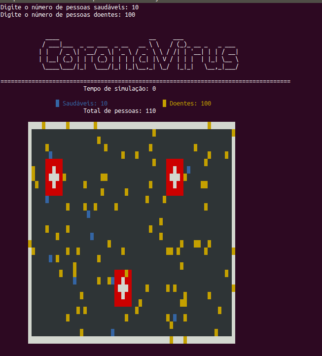

# Simulador Propagação CoronaVirus

Projeto para a matéria de Programação Orientada a Objetos, disciplina cursada no Centro Universitário FEI. O software realiza a simulação do efeito de propagação de uma virose.

## Execução

Tanto no Windows quanto no Linux a execução é feita a partir da execução da linha a seguir no terminal, estando dentro da pasta /src. Outro modo é utilizando uma IDE de sua preferência para executar o projeto java. 

```bash
javac Main.java
java Main
```

A aplicação solicita ao usuário o número de pessoas saudáveis e doentes para realizar a simulação de propagação. 



A simulação é feita a partir de uma matriz de pontos coloridas representando os hospitais, pessoas infectadas e pessoas saudáveis. Movendo-as de forma randômica ao longo do cenário. 
O video abaixo foi postado no Youtube demonstrando uma simulação do software.

[](https://www.youtube.com/watch?v=NMv0SSdDm-c&t=19s)
